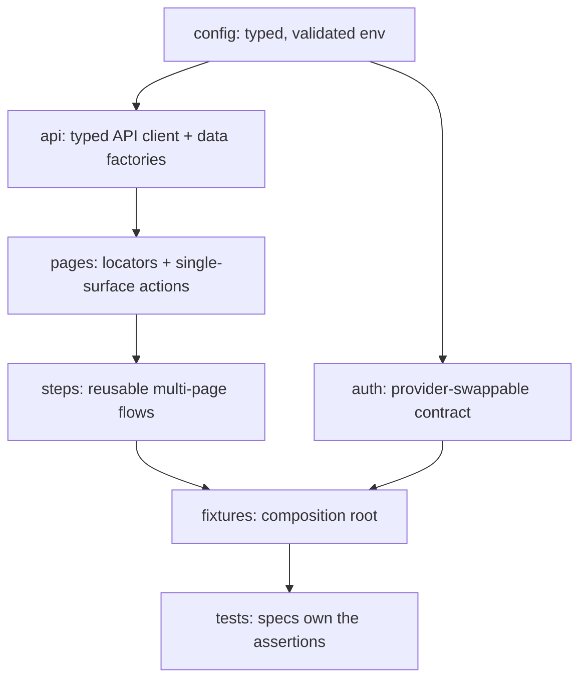

# Architecture

This is the living companion to
[ADR-0002: Core Principles](docs/decisions/0002-core-principles.rst). The ADR
fixes the _intent_; this document carries the _mechanics_ and evolves with the
code.

## Layered architecture

The suite is built from layers with a single, strict dependency direction. Each
layer has one responsibility, and higher-level composition happens one layer up.



A layer may depend only on the layers above it in the list below — never sideways
into a sibling or downward into a consumer.

| Layer             | Directory       | Responsibility                                                                               | May depend on                               |
| ----------------- | --------------- | -------------------------------------------------------------------------------------------- | ------------------------------------------- |
| Configuration     | `src/config/`   | Turn env vars into a validated, typed, immutable config; fail fast on bad input.             | —                                           |
| Auth contract     | `src/auth/`     | Provider-swappable sign-in → one multi-origin storage state per role.                        | `config` (and `api`/`pages` for real flows) |
| API client / data | `src/api/`      | Typed HTTP clients and deterministic, unique-per-run data factories.                         | `config`                                    |
| Page objects      | `src/pages/`    | Locators and single-surface actions for one screen. Mirrors the `tests/` tree.               | `config`, `api`                             |
| Steps             | `src/steps/`    | Compose page objects into reusable business flows (actions/navigation, not assertions).      | `pages`, `api`, `config`                    |
| Fixtures          | `src/fixtures/` | Composition root: hand specs fully-composed, typed objects (config, pages, api, data, auth). | all of the above                            |
| Tests             | `tests/`        | Specs that own the assertions deciding pass/fail. Grouped by platform domain.                | `fixtures`                                  |

## Domain-oriented organization

Tests are organized **primarily by platform domain** (`lms/`, `studio/`, and
sub-areas like `lms/auth`, `lms/course-home`), and page objects mirror that tree:

```
tests/lms/course-home/badges.spec.ts
  -> src/pages/lms/course-home/badges.page.ts
```

Everything else about a test — stability tier, capability, MFE — is expressed with
**tags**, not more folders. See [CONVENTIONS.md](CONVENTIONS.md).

## Authentication and multi-origin sessions

A single Open edX sign-in sets cookies scoped to the shared registrable parent
domain, so one captured storage state authenticates the LMS, Studio, and every
MFE origin. The auth contract captures that state once per role (a Playwright
`setup` project → `.auth/<role>.json`); authenticated projects consume it via
`use: { storageState }`. We never disable browser security to paper over
cross-origin auth. Full rationale:
[docs/planning/auth-storage-state-deep-dive.md](docs/planning/auth-storage-state-deep-dive.md).

## Playwright projects

| Project      | Purpose                                                                        |
| ------------ | ------------------------------------------------------------------------------ |
| `unit`       | Pure logic tests (e.g. config validation). No browser or target. Tag: `@unit`. |
| `setup`      | Signs in once per role and writes storage state. Stubbed until Epic 2.         |
| `smoke`      | Critical-path browser tests. Tag: `@smoke`.                                    |
| `regression` | Broader-depth browser tests. Tag: `@regression`.                               |

Configuration lives in [`playwright.config.ts`](playwright.config.ts); timeouts
are centralized in `src/config/timeouts.ts` (no fixed sleeps).
