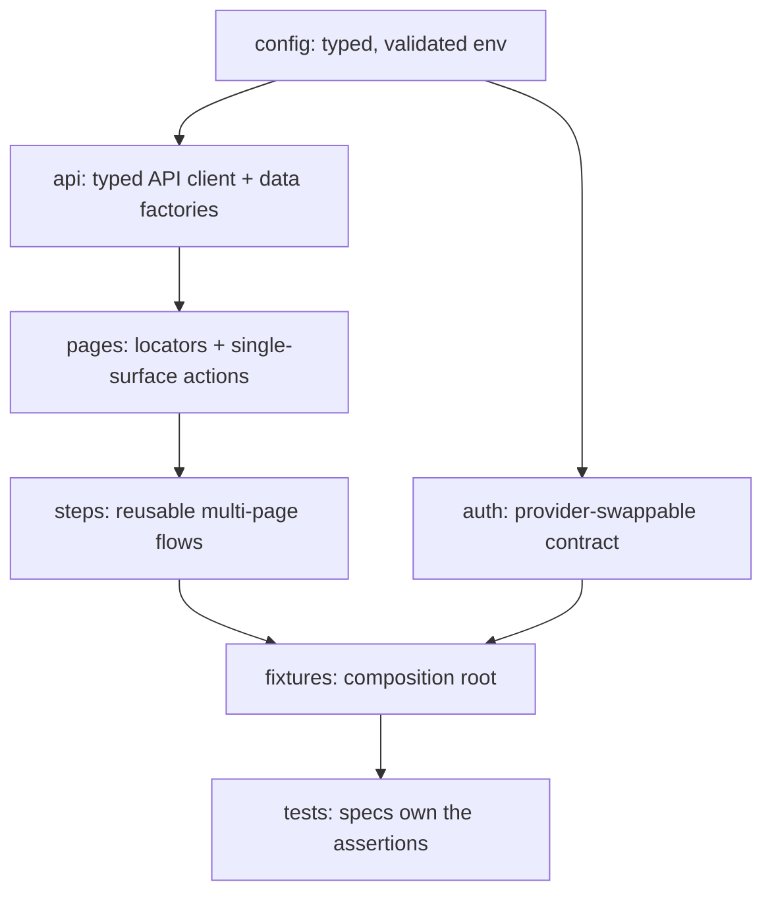

# Architecture

This is the living companion to
[ADR-0002: Core Principles](docs/decisions/0002-core-principles.rst). The ADR
fixes the _intent_; this document carries the _mechanics_ and evolves with the
code.

## Layered architecture

The suite is built from layers with a single, strict dependency direction. Each
layer has one responsibility, and higher-level composition happens one layer up.



A layer may depend only on the layers above it in the list below — never sideways
into a sibling or downward into a consumer.

| Layer             | Directory       | Responsibility                                                                               | May depend on               |
| ----------------- | --------------- | -------------------------------------------------------------------------------------------- | --------------------------- |
| Configuration     | `src/config/`   | Turn env vars into a validated, typed, immutable config; fail fast on bad input.             | —                           |
| Auth contract     | `src/auth/`     | Provider-swappable sign-in → one multi-origin storage state per role.                        | `config`, `api`, `accounts` |
| Account backends  | `src/accounts/` | User-choosable account creation/activation (email-validation handling) per target.           | `config`, `api`             |
| API client / data | `src/api/`      | Typed HTTP clients and deterministic, unique-per-run data factories.                         | `config`                    |
| Page objects      | `src/pages/`    | Locators and single-surface actions for one screen. Mirrors the `tests/` tree.               | `config`, `api`             |
| Steps             | `src/steps/`    | Compose page objects into reusable business flows (actions/navigation, not assertions).      | `pages`, `api`, `config`    |
| Fixtures          | `src/fixtures/` | Composition root: hand specs fully-composed, typed objects (config, pages, api, data, auth). | all of the above            |
| Tests             | `tests/`        | Specs that own the assertions deciding pass/fail. Grouped by platform domain.                | `fixtures`                  |

## Domain-oriented organization

Tests are organized **primarily by platform domain** (`lms/`, `studio/`, and
sub-areas like `lms/auth`, `lms/course-home`), and page objects mirror that tree:

```
tests/lms/course-home/badges.spec.ts
  -> src/pages/lms/course-home/badges.page.ts
```

Everything else about a test — stability tier, capability, MFE — is expressed with
**tags**, not more folders. See [CONVENTIONS.md](CONVENTIONS.md).

## Locators never depend on displayed text

Target installations can run in any language, so a locator or assertion that
matches visible UI copy — a button's label, a heading, an alert's wording —
breaks the moment the site language changes. The suite therefore **never selects
or asserts on the platform's localized text**. Locate and verify elements by, in
order of preference:

1. **Test IDs** — `getByTestId(...)`.
2. **Stable attributes / roles** — `name` / `id` / `href` attributes, or
   `getByRole('<role>')` with no localized `name`.
3. **Structural CSS** — last resort, language-independent structure (e.g. a
   section `id` plus position).

Matching a value the **test itself supplied** (a generated username, a name we
typed) is fine — that is our own data, not localized. What's forbidden is
depending on strings the target renders: `getByText`, `getByLabel`,
`getByRole(..., { name: '<literal>' })`, `toContainText('<literal>')`, `hasText`,
`:has-text()`, and the like.

This rule is enforced by `tests/conventions/no-displayed-text.spec.ts`, which
fails if any page object, step, or spec matches a literal UI string.

## Authentication and multi-origin sessions

A single Open edX sign-in sets cookies scoped to the shared registrable parent
domain, so one captured storage state authenticates the LMS, Studio, and every
MFE origin. The default provider (`ApiAuthProvider`) captures the parent-domain
cookie jar into one storage state. For the `learner` role it provisions an account
via the configured **account backend** (`src/accounts/`, selected by
`ACCOUNT_BACKEND`) and captures the session that registration itself creates
("Automatic login on"), so no separate sign-in is needed — which is what lets it
work against the default even when an install leaves accounts inactive until
activation. The `staff` role signs in through the login-session API
(`GET /csrf/api/v1/token` → `POST .../login_session/`) with the configured admin
account. The auth contract captures that state once
per role (a Playwright `setup` project → `.auth/<role>.json`); authenticated
projects consume it via `use: { storageState }`. We never disable browser
security to paper over cross-origin auth. Full rationale:
[docs/planning/auth-storage-state-deep-dive.md](docs/planning/auth-storage-state-deep-dive.md).

## Playwright projects

| Project       | Purpose                                                                                 |
| ------------- | --------------------------------------------------------------------------------------- |
| `unit`        | Pure logic tests (e.g. config validation). No browser or target. Tag: `@unit`.          |
| `setup`       | Signs in once per role via the auth contract and writes `.auth/<role>.json`.            |
| `smoke`       | Critical-path browser tests, anonymous. Tag: `@smoke` (excludes `@authenticated`).      |
| `regression`  | Broader-depth browser tests, anonymous. Tag: `@regression` (excludes `@authenticated`). |
| `lms-learner` | Authenticated tests reusing the captured learner state. Tag: `@authenticated`.          |

## Cross-cutting testing modules

Two `src/` modules support specs across every domain rather than a single layer:

| Module           | Responsibility                                                                                                                                                                          |
| ---------------- | --------------------------------------------------------------------------------------------------------------------------------------------------------------------------------------- |
| `src/reporting/` | BTR `test_id` annotations + coverage reporter (`test-results/btr-coverage.json`), and the accessibility reporter that consolidates every scan into `test-results/a11y-violations.json`. |
| `src/a11y/`      | The `@axe-core/playwright` gate (`checkA11y`) for WCAG 2.2 AA, with a known-debt baseline. Per-scan results are attached to each test and aggregated by the reporter above.             |

Configuration lives in [`playwright.config.ts`](playwright.config.ts); timeouts
are centralized in `src/config/timeouts.ts` (no fixed sleeps).
