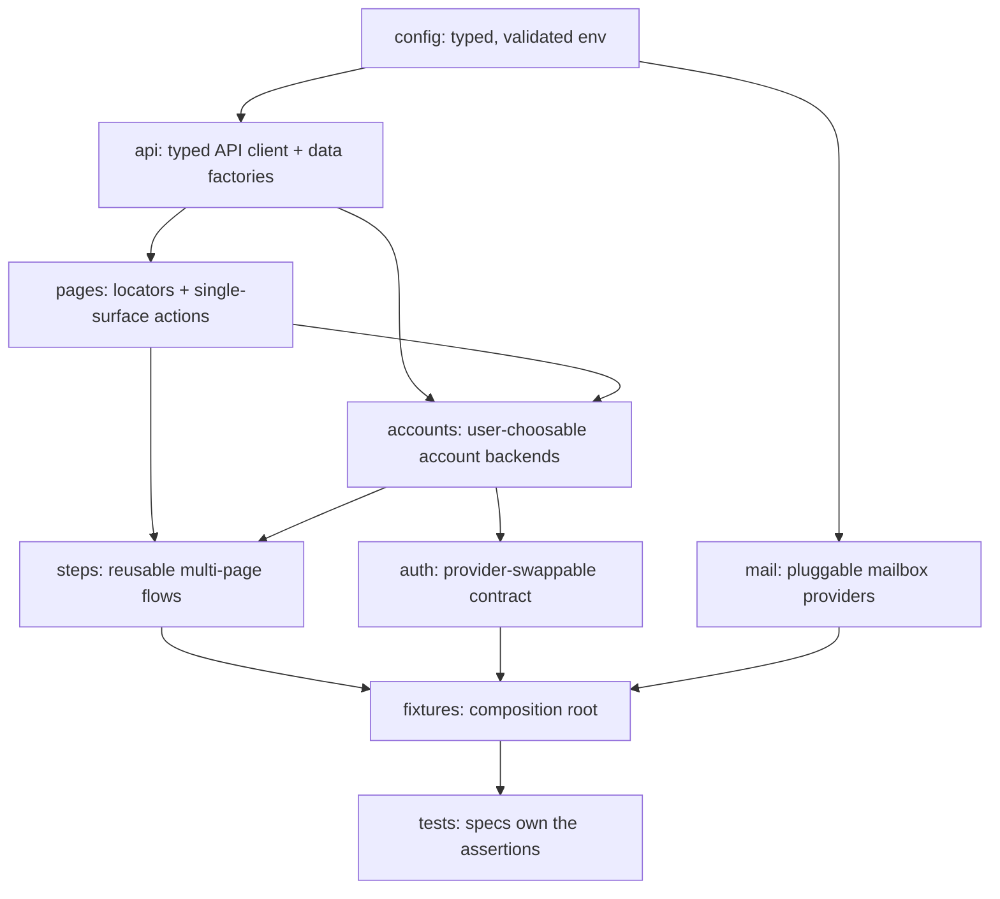

# Architecture

This is the living companion to
[ADR-0002: Core Principles](docs/decisions/0002-core-principles.rst). The ADR
fixes the _intent_; this document carries the _mechanics_ and evolves with the
code.

## Layered architecture

The suite is built from layers with a single, strict dependency direction. Each
layer has one responsibility, and higher-level composition happens one layer up.



A layer may depend only on the layers above it in the list below — never sideways
into a sibling or downward into a consumer.

| Layer             | Directory       | Responsibility                                                                               | May depend on                        |
| ----------------- | --------------- | -------------------------------------------------------------------------------------------- | ------------------------------------ |
| Configuration     | `src/config/`   | Turn env vars into a validated, typed, immutable config; fail fast on bad input.             | —                                    |
| Auth contract     | `src/auth/`     | Provider-swappable sign-in → one multi-origin storage state per role.                        | `config`, `accounts`                 |
| Account backends  | `src/accounts/` | User-choosable account creation/activation and the default sign-in/sign-out flows.           | `config`, `api`, `pages`             |
| Mailbox providers | `src/mail/`     | Pluggable inboxes the suite reads e-mail from (`MAIL_PROVIDER`); the `email-inbox` oracle.   | `config`                             |
| API client / data | `src/api/`      | Typed HTTP clients and deterministic, unique-per-run data factories.                         | `config`                             |
| Page objects      | `src/pages/`    | Locators and single-surface actions for one screen. One per surface, in its domain folder.   | `config`, `api`                      |
| Steps             | `src/steps/`    | Compose page objects into reusable business flows (actions/navigation, not assertions).      | `pages`, `api`, `accounts`, `config` |
| Fixtures          | `src/fixtures/` | Composition root: hand specs fully-composed, typed objects (config, pages, api, data, auth). | all of the above                     |
| Tests             | `tests/`        | Specs that own the assertions deciding pass/fail. Grouped by platform domain.                | `fixtures`                           |

## Domain-oriented organization

Tests are organized **primarily by platform domain** (`lms/`, `studio/`, and
sub-areas like `lms/auth`, `lms/course-home`), and page objects live in the same
domain folder. Specs are one per **Feature**; page objects are one per
**surface** the platform renders, so the two trees share folders but not file
names — several specs compose one page object, and a spec that spans surfaces
uses several:

```
tests/lms/catalog/discovery.spec.ts     ┐   src/pages/lms/catalog/catalog.page.ts
tests/lms/catalog/enrollment.spec.ts    ┘   src/pages/lms/catalog/course-about.page.ts
tests/lms/course-home/outline.spec.ts   →   src/pages/lms/course-home/course-outline.page.ts
```

A component that lives _inside_ a surface — an XBlock rendered in a unit — gets a
`*.block.ts` object beside the page it belongs to (`courseware/problem.block.ts`).

Everything else about a test — stability tier, capability, MFE — is expressed with
**tags**, not more folders. See [CONVENTIONS.md](CONVENTIONS.md).

## Locators never depend on displayed text

Target installations can run in any language, so a locator or assertion that
matches visible UI copy — a button's label, a heading, an alert's wording —
breaks the moment the site language changes. The suite therefore **never selects
or asserts on the platform's localized text**. Locate and verify elements by, in
order of preference:

1. **Test IDs** — `getByTestId(...)`.
2. **Stable attributes / roles** — `name` / `id` / `href` attributes, or
   `getByRole('<role>')` with no localized `name`.
3. **Structural CSS** — last resort, language-independent structure (e.g. a
   section `id` plus position).

Matching a value the **test itself supplied** (a generated username, a name we
typed) is fine — that is our own data, not localized. What's forbidden is
depending on strings the target renders: `getByText`, `getByLabel`,
`getByRole(..., { name: '<literal>' })`, `toContainText('<literal>')`, `hasText`,
`:has-text()`, and the like.

This rule is enforced by `tests/conventions/no-displayed-text.spec.ts`, which
fails if any page object, step, or spec matches a literal UI string.

One deliberate use of the last tier: legacy CAPA problems expose no test IDs and
no useful roles, only server-rendered structural classes (`.problem`,
`button.submit`, `.status.correct`) that the platform's own scripts key off. Those
are the anchors in `src/config/selectors/capa.ts`, and ADR-0002 already exempts
course content from the text rule because problem copy does not localize.

## Authentication and multi-origin sessions

A single Open edX sign-in sets cookies scoped to the shared registrable parent
domain, so one captured storage state authenticates the LMS and every MFE origin.
Studio is the one exception: it keeps its **own** Django session, obtained through
a silent OAuth handshake (`GET studio/login/` → LMS `/oauth2/authorize` → back to
Studio) that needs no credentials or UI once the LMS session exists. The default
provider performs that handshake for the authoring roles (`author`, `staff`) when
`studio` is declared, so the same one storage state covers Studio too
(`src/api/studio-session.ts`). The default provider (`ApiAuthProvider`) captures
the resulting cookie jar into one storage state. For the `learner` role it provisions an account
via the configured **account backend** (`src/accounts/`, selected by
`ACCOUNT_BACKEND`) and captures the session that registration itself creates
("Automatic login on"), so no separate sign-in is needed — which is what lets it
work against the default even when an install leaves accounts inactive until
activation. The `staff` role signs in with the configured admin account through
the backend's `signIn` hook, which by default is the login-session API
(`GET /csrf/api/v1/token` → `POST .../login_session/`). The `author` role
provisions a learner the same way, completes the Studio handshake, and has the
backend's `grantCourseCreator` hook make it a course creator — by default the
request-then-Django-admin flow of BTR TC-00310, using the admin account.

The `studio-author` project does not reuse that author state directly: its
`workerAuthor` fixture provisions one author per worker the same way and points the
worker's `page` and `request` at it, because the platform's
`PREVENT_CONCURRENT_LOGINS` ends a user's other sessions on each sign-in — so a
shared author would have workers logging each other out. A browser spec normally
completes Studio's SSO silently off the loaded state (no login); only when that
stored session has decayed does `studioAuthorSession` fall back to a single UI
re-login, refreshing the worker's state file. The single shared admin account is
used only under a cross-worker lock (`withAdminSession`), reusing the `setup`
session where it is still alive.

A `studio-author` round-trip test carries **two actors in two contexts**: the
author on the worker's `page` (and `page.request`), and a learner the test
provisions as a separate user with its own `browser.newContext()` plus `request`
(`roundTripLearner`, `futureCourseLearner`, `authoringCourseLearner`). The author
publishes; the learner reads. They never share a context — a session cookie for
one user replayed with a JWT for another forces a logout — so a learner is never
signed in on the author's `page`. Cohort and other LMS session-auth writes, which
a JWT-only context cannot make, run on a third throwaway context signed in afresh
as the author (see [`.private/studio-auth-resilience.md`](.private/studio-auth-resilience.md)).

The **instructor** persona is the same worker author: a course's creator holds
the `instructor` and `staff` course roles on it (course-team membership is data,
not a session role — see `src/auth/roles.ts`), the seeds add the `data_researcher`
role, and the instructor-dashboard MFE's `/api/instructor/v2/` accepts the JWT, so
`tests/lms/instructor/` runs in `studio-author` on `page` / `page.request` with a
`roundTripLearner` as the second actor. The global `instructor` role stays
installation-supplied. The one session-only write in that tree — enabling
platform-wide certificate generation in the LMS Django admin — runs on a fresh
admin `loginSession` context under the admin lock. The **taxonomy admin** is the
same admin account: managing taxonomies and seeding upload-agreement rows are
staff-only, so they run under that lock too (`taxonomyAdmin` in a Studio browser,
`uploadAgreements` on an LMS Django session).

The **library admin** persona is the same worker author too: creating a content
library (v2) makes its creator the library's `admin`, and the
`/api/libraries/v2/` API rides the author's Studio session (measured: no JWT
needed), so `tests/studio/library/` runs in
`studio-author` on `page` / `page.request`. Its second actors — a library
member, an unaffiliated Studio user — are **course creators** provisioned per
test on their own contexts (`studioColleague`), because `allow_public_read`
grants a plain learner nothing. The legacy library writes and the course-side
import are session-authed, and the v2 writes rotate the Studio session while
the API SSO handshake corrupts one whose LMS half a provisioned learner has left
stale; so these specs re-sync through the browser (`resyncStudioAuthor`) and
provision their learner last, and the `request`-context fixtures handshake only
after a write has 302'd (see [`CONVENTIONS.md`](CONVENTIONS.md) "Library round
trips").

The **roles-and-permissions** personas (`tests/rbac/`) are a worker-scoped
**cast**: `rbacCast(part)` provisions one account per part it plays —
`instructor`, `staff`, `courseAdmin`, `libraryUser`, `outsider`, … — on first
use, and every spec in the worker shares them. An account only ever plays the
part it is named for, so reuse cannot hand a case a role it did not expect, and
a full run of the tree stays inside the platform's registration and sign-in
limits. A case that needs an account with no history of its own still takes
`studioColleague`. Their surfaces live in `src/pages/admin-console/` (the
console shell, Team Members, the user audit view, the Assign Role wizard and the
permission matrix), and everything that moves a waffle override or reads a
migration run goes through the LMS Django admin under the same admin lock as the
taxonomy personas (see [`CONVENTIONS.md`](CONVENTIONS.md) "Roles and permissions
(RBAC)").

The **notification and forum** personas (`tests/lms/notifications/`,
`tests/lms/discussions/`) reuse the worker author as the course's instructor
and staff (notify-all posts, course updates, ORA grades, and the recipient of
staff-only notifications). Everyone else is a learner on their own context:
the **recipient** is fresh for every case (`notificationRecipient`), because
what it received is the assertion, and the learners who post and moderate are
a worker-scoped `forumCast`. E-mail cases register their recipient at an inbox
of the configured mailbox provider (`mailboxLearner`, `src/mail/`), and the
suite reads the mail through that provider's API — a Mailpit catcher on the CI
Tutor stack.

The **learner-page** personas (Epic 14) are mostly one fresh learner per test
(`courseLearner`, `roundTripLearner`), because what a learner bookmarked,
completed or chose is the assertion. Two more complete them: a **profile
viewer**, a second fresh learner on a request context of its own, whose reading
decides every privacy case; and **global staff**, the admin in a browser
(`adminPage`), for the dashboard's "View as". Platform-wide switches that one
case changes and others rely on are serialised by a named cross-worker
reader/writer lock (`src/fixtures/named-lock.ts`) beside the admin lock — the
certificate auto-generation switch is the first, the ORA team-submissions
switch the second.

The **instructor-dashboard role** personas (Epic 15) are the worker author as
the course's instructor, plus a worker-scoped `instructorCast`: one plain
account per role it is granted — `staff`, `limitedStaff`, a staff
`discussionAdmin`, a `teamMember` — enrolled nowhere until a test grants it a
role on its own course. Course e-mail is sent by a mailbox learner granted
course staff, on its own context, because the communications MFE needs an LMS
session the author's browser does not hold.

The account backend is therefore the seam for an install with custom auth: it
supplies `createIdentity` and `activate`, and may override `signIn` (headless,
used by `setup`), `signInStudio` (the Studio half of every authoring session, the
`cms-sso` handshake by default), `signInThroughUi` and `signOutThroughUi` (what
the login and logout specs drive), and `grantCourseCreator`. A backend ships as a plugin module listed in
`CUSTOM_ACCOUNT_BACKEND_PLUGINS`; see [`src/accounts/README.md`](src/accounts/README.md).

`tests/global-setup.ts` runs once before any project: it clears `.auth/` so a
stale session never carries over, and loads the account backends so a bad plugin
path fails the run up front. The `setup` project then captures state once per
role (`.auth/<role>.json`); authenticated projects consume it via
`use: { storageState }`. Course-state specs additionally use the `courseLearner`
fixture, which provisions a fresh learner per test and installs that session in
place of the shared one, so tests that mutate enrollment or completion never
collide. We never disable browser security to paper over cross-origin auth.

## Playwright projects

| Project         | Purpose                                                                                            |
| --------------- | -------------------------------------------------------------------------------------------------- |
| `unit`          | Pure logic tests (e.g. config validation). No browser or target. Tag: `@unit`.                     |
| `setup`         | Signs in once per role via the auth contract and writes `.auth/<role>.json`.                       |
| `smoke`         | Critical-path browser tests, anonymous. Tag: `@smoke` (excludes `@authenticated`, `@author`).      |
| `regression`    | Broader-depth browser tests, anonymous. Tag: `@regression` (excludes `@authenticated`, `@author`). |
| `lms-learner`   | Authenticated tests reusing the captured learner state. Tag: `@authenticated`.                     |
| `studio-author` | Studio tests, each worker as an author of its own (LMS + Studio session). Tag: `@author`.          |

## Cross-cutting testing modules

Two `src/` modules support specs across every domain rather than a single layer:

| Module           | Responsibility                                                                                                                                                                                                                                                                                                                                                                                                                                                               |
| ---------------- | ---------------------------------------------------------------------------------------------------------------------------------------------------------------------------------------------------------------------------------------------------------------------------------------------------------------------------------------------------------------------------------------------------------------------------------------------------------------------------- |
| `src/reporting/` | BTR `test_id` / `known_gap` annotations, the coverage reporter (`test-results/btr-coverage.json`), the run-detail reporter (`test-results/btr-run.json`, per-case specs/notes/timing + run metadata, the input to the results-sheet publisher in `scripts/btr-sheet/`), the accessibility reporter that consolidates every scan into `test-results/a11y-violations.json`, and the timing reporter that writes per-test / per-step durations to `test-results/timings-*.csv`. |
| `src/a11y/`      | The `@axe-core/playwright` gate (`checkA11y`) for WCAG 2.2 AA, with a known-debt baseline. Per-scan results are attached to each test and aggregated by the reporter above.                                                                                                                                                                                                                                                                                                  |

Configuration lives in [`playwright.config.ts`](playwright.config.ts); timeouts
are centralized in `src/config/timeouts.ts` (no fixed sleeps).
